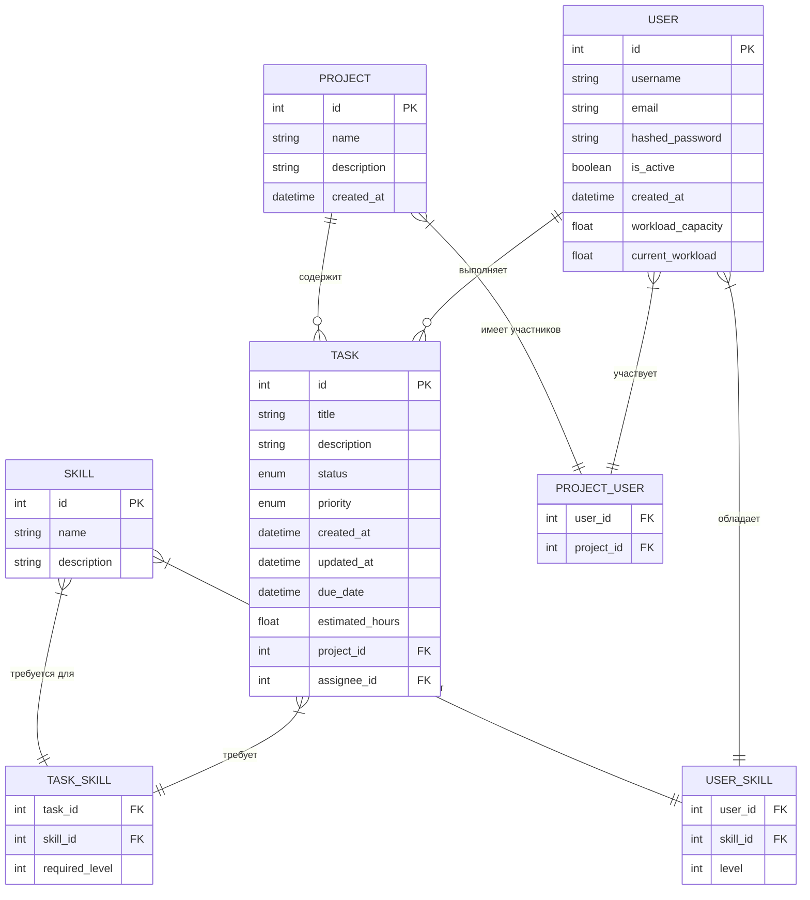

# ER-диаграмма проекта TaskMaster

## Описание сущностей и связей

### Основные сущности:

1. **User** (Пользователь)
   - Основные атрибуты: id, username, email, hashed_password
   - Дополнительные атрибуты: workload_capacity (максимальная нагрузка), current_workload (текущая нагрузка)

2. **Project** (Проект)
   - Атрибуты: id, name, description, created_at

3. **Task** (Задача)
   - Основные атрибуты: id, title, description, status, priority
   - Временные атрибуты: created_at, updated_at, due_date (срок)
   - Трудоемкость: estimated_hours (оценка в часах)
   - Связи: project_id (проект), assignee_id (исполнитель)

4. **Skill** (Навык)
   - Атрибуты: id, name, description

### Связующие таблицы:

1. **PROJECT_USER** - связь многие-ко-многим между пользователями и проектами
   - user_id, project_id

2. **USER_SKILL** - связь многие-ко-многим между пользователями и навыками
   - user_id, skill_id, level (уровень навыка от 1 до 5)

3. **TASK_SKILL** - связь многие-ко-многим между задачами и навыками
   - task_id, skill_id, required_level (требуемый уровень навыка)

### Основные связи:

- Пользователь может быть участником многих проектов, проект может иметь много участников
- Пользователь может выполнять много задач, задача назначается одному исполнителю
- Проект содержит много задач, задача принадлежит одному проекту
- Пользователь может обладать многими навыками, навык может быть у многих пользователей
- Задача может требовать многих навыков, навык может требоваться для многих задач 