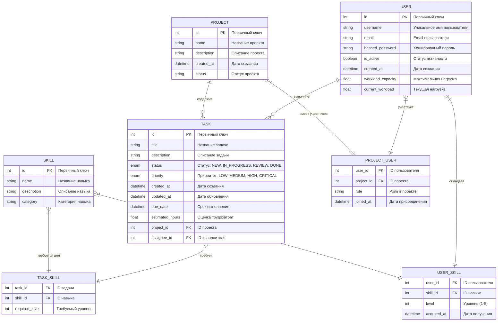

# ER-диаграмма проекта TaskMaster

## Описание сущностей и связей

### Основные сущности:

1. **User** (Пользователь)
   - Основные атрибуты: id, username, email, hashed_password
   - Дополнительные атрибуты: 
     - workload_capacity (максимальная нагрузка)
     - current_workload (текущая нагрузка)
     - is_active (статус активности)
     - created_at (дата создания)

2. **Project** (Проект)
   - Атрибуты: 
     - id (первичный ключ)
     - name (название)
     - description (описание)
     - created_at (дата создания)
     - status (статус проекта)

3. **Task** (Задача)
   - Основные атрибуты: 
     - id (первичный ключ)
     - title (название)
     - description (описание)
     - status (статус: NEW, IN_PROGRESS, REVIEW, DONE)
     - priority (приоритет: LOW, MEDIUM, HIGH, CRITICAL)
   - Временные атрибуты: 
     - created_at (дата создания)
     - updated_at (дата обновления)
     - due_date (срок выполнения)
   - Трудоемкость: estimated_hours (оценка в часах)
   - Связи: 
     - project_id (проект)
     - assignee_id (исполнитель)

4. **Skill** (Навык)
   - Атрибуты: 
     - id (первичный ключ)
     - name (название)
     - description (описание)
     - category (категория навыка)

### Связующие таблицы:

1. **PROJECT_USER** - связь многие-ко-многим между пользователями и проектами
   - user_id (ID пользователя)
   - project_id (ID проекта)
   - role (роль в проекте)
   - joined_at (дата присоединения)

2. **USER_SKILL** - связь многие-ко-многим между пользователями и навыками
   - user_id (ID пользователя)
   - skill_id (ID навыка)
   - level (уровень навыка от 1 до 5)
   - acquired_at (дата получения навыка)

3. **TASK_SKILL** - связь многие-ко-многим между задачами и навыками
   - task_id (ID задачи)
   - skill_id (ID навыка)
   - required_level (требуемый уровень навыка)

### Основные связи:

- Пользователь может быть участником многих проектов, проект может иметь много участников
- Пользователь может выполнять много задач, задача назначается одному исполнителю
- Проект содержит много задач, задача принадлежит одному проекту
- Пользователь может обладать многими навыками, навык может быть у многих пользователей
- Задача может требовать многих навыков, навык может требоваться для многих задач 